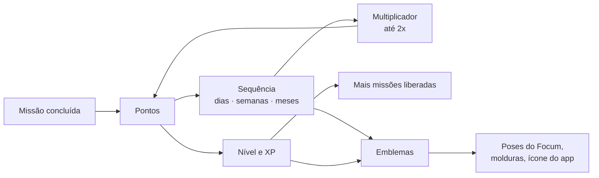
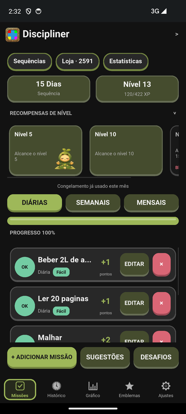
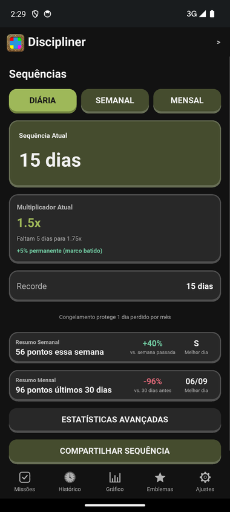
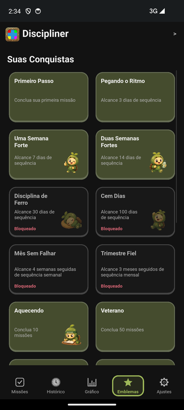
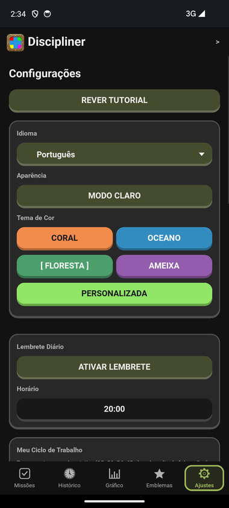

# Discipliner


> **EN:** A habit and discipline app for Android, written in Python with Kivy. Daily, weekly and monthly missions turn into points, streaks and levels; streaks unlock point multipliers, badges, avatar frames and a mascot with unlockable poses. Cloud account, light/dark themes and five languages. Full details below are in Portuguese, the project's language.

Um app pra criar disciplina do jeito que um jogo cria vício: cada coisa que eu quero fazer vira uma missão, cada missão concluída vira ponto, e ponto vira sequência, nível e recompensa. Fiz em Python porque é a linguagem que eu mais uso, e com Kivy porque ele deixa o mesmo código rodar no computador (onde eu desenvolvo) e no Android (onde o app vive de verdade).

A ideia central: não deixar a pessoa "quebrar a corrente". Por isso tem sequência por tipo de missão, congelamento pra dia ruim, lembrete com o app fechado e aviso pra quem sumiu.



## Capturas de tela

<p align="center">
  
  
  
  
</p>

## Antes de rodar

Esse repositório tem só o código e os assets. Não sobe banco de dados, APK, chave de assinatura nem nada de conta (tá tudo no `.gitignore`).

Pra rodar no computador:

1. Instala o **Python 3.12**. Precisa ser o 3.12: o Kivy ainda não tem pacote pro 3.14 no Windows.
2. Cria uma venv com ele e instala as dependências:
   ```
   py -3.12 -m venv venv
   venv\Scripts\pip install -r requirements.txt
   ```
3. Roda:
   ```
   venv\Scripts\python main.py
   ```

Na primeira vez aparece o onboarding (idioma, tema, termos) e a escolha entre criar conta, entrar ou continuar como convidado. **Como convidado nada sai do aparelho**, dá pra usar o app inteiro offline.

## As telas

**Missões** é a tela principal. Três abas em cima da lista (**Diárias / Semanais / Mensais**) trocam o que aparece: a lista, a barra de progresso e o card de sequência passam a ser só daquele tipo. O "+ Adicionar missão" já abre no tipo da aba em que eu estou. Nas pílulas do topo ficam os atalhos pra **Sequências**, **Loja** (com os pontos disponíveis) e **Estatísticas**.

Cada missão tem nome, periodicidade, dificuldade e, opcionalmente, instruções (tipo a lista de exercícios do treino), dias específicos da semana, ciclo de trabalho e um horário de alarme.

**Sequências** mostra a sequência atual e o recorde de cada tipo, o multiplicador de pontos que ela garante agora e quanto falta pro próximo degrau.

**Histórico** e **Gráfico** mostram o que eu já concluí: lista com as observações de cada conclusão, mapa de calor do mês e gráficos de barras/linhas.

**Emblemas** são as conquistas. Cada emblema desbloqueado pode virar título ao lado do avatar.

**Ajustes** tem idioma, tema claro/escuro, cor de destaque, lembrete diário, ciclo de trabalho, conta e backup.

## Como a pontuação funciona

Os pontos são fixos por tipo e dificuldade, pra ninguém inflar o próprio placar:

| | Fácil | Média | Difícil |
|---|---|---|---|
| Diária | 1 | 2 | 3 |
| Semanal | 5 | 7 | 10 |
| Mensal | 10 | 15 | 25 |

**Sequência.** Cada tipo tem a sua: dias seguidos, semanas seguidas, meses seguidos. Um período só conta se pelo menos **65%** das missões daquele tipo foram concluídas, não basta marcar uma qualquer.

**Multiplicador.** Quanto maior a sequência, mais cada missão vale. Cada missão usa a sequência do próprio tipo:

| Diária | Semanal | Mensal | Multiplicador |
|---|---|---|---|
| 5+ dias | 2+ semanas | 1+ mês | 1.25x |
| 10+ dias | 4+ semanas | 2+ meses | 1.5x |
| 20+ dias | 6+ semanas | 3+ meses | 1.75x |
| 30+ dias | 8+ semanas | 4+ meses | 2.0x |

**Congelamento.** Um dia ruim não precisa zerar a sequência diária: 1 congelamento por mês (3 no Premium, ilimitado no Modo Sem Penalidade).

**Bônus permanente.** Ao contrário do multiplicador, esse nunca some: +5% pra sempre em cada marco batido (sequência recorde de 100 dias, 100 missões concluídas, nível 15).

**Desafios.** Pacotes temáticos de missões. Missão que veio de um desafio vale 1.5x.

**Nível.** Sai da soma de todos os pontos que eu já ganhei. Cada nível pede um pouco mais de XP que o anterior, e cada nível libera mais missões ativas (7 no começo, +1 por nível; 15 e +2 por nível no Premium).

## Focum, o mascote

<p align="center">
  
</p>

O Focum acompanha o progresso. Cada pose nova é uma conquista: sete dias de sequência, cem missões concluídas, nível cinco, e assim por diante. As poses viram avatar de perfil, e os degraus do multiplicador liberam molduras e ícones alternativos do app.

## Lembretes e alarmes

- **Lembrete diário:** no horário que eu escolho, só se ainda tiver missão pendente. A frase muda a cada dia.
- **Alarme de missão:** missão com horário marcado toca como despertador de verdade, com tela cheia por cima do bloqueio e botão de encerrar, mesmo com o app fechado.
- **Reconquista:** quem para de concluir missões recebe um aviso com 2, 5 e 14 dias de ausência, e depois disso o app para de insistir.

Com o app fechado, quem entrega é um serviço Android acordado pelo `AlarmManager` no horário exato: ele notifica, reagenda o próximo e encerra. Não fica nada rodando o tempo todo.

## Conta e nuvem

A conta é opcional e roda no **Supabase**:

- Cadastro e login por **link no e-mail**: tocar no link abre o app e entra sozinho.
- **Backup automático** do progresso na nuvem, e restauração automática ao entrar em outro aparelho.
- **Trocar senha** por link que abre uma tela dedicada no app.
- **Apagar conta** com confirmação e código por e-mail. Apaga a conta, o backup e o progresso local.

## Segurança

- **RLS em todas as tabelas.** A chave que vai dentro do APK é a pública; quem decide o que cada um lê e grava é o banco, não o app.
- **Deep link não é confiável.** Qualquer app ou página pode abrir `discipliner://login-callback`, então o app só aceita o link do e-mail que **este aparelho** pediu, e só uma vez.
- **Apagar conta exige código novo por e-mail.** A Edge Function `delete-account` só aceita uma sessão que acabou de ser confirmada por código, de até 10 minutos.
- **Backups sem token.** A sessão da conta é removida do arquivo antes de exportar ou subir pra nuvem, e restaurar um backup de terceiro não troca a conta logada.
- **Pagamento confirmado no servidor.** Os webhooks (Stripe e Mercado Pago) validam assinatura ou buscam o pagamento de novo na API, com idempotência.
- **Telemetria e crash anônimos.** Só um identificador aleatório de instalação, nunca e-mail, nome ou missão (detalhes abaixo).

Achou uma falha? Veja como reportar em [`SECURITY.md`](SECURITY.md).

## Privacidade: o que o app manda pra fora

- **Relato de crash:** texto do erro, versão do app e do sistema, identificador aleatório.
- **Retenção:** no máximo 2 avisos por dia ("abriu o app hoje" e "concluiu alguma missão hoje", sim/não), com a data e a versão. Só no Android.
- **Anúncios (versão grátis):** Google AdMob, com tela de consentimento na União Europeia.

Tudo isso está descrito na Política de Privacidade dentro do próprio app.

## Premium

Compra única, sem assinatura: remove anúncios, aumenta o limite de missões, dá mais congelamentos e o Modo Sem Penalidade, libera cor de destaque livre, foto de perfil própria, banner personalizado, alarme por missão e estatísticas avançadas.

## Build do Android

O APK é buildado localmente, no **WSL (Ubuntu 22.04)**, com Buildozer e python-for-android. O Buildozer não roda no Windows.

```
bash scripts/build-local.sh
```

O primeiro build leva de 30 a 60 minutos (baixa SDK, NDK e recipes); os seguintes levam poucos minutos. Alvo: Android 14 (API 34), mínimo Android 5.0 (API 21), `arm64-v8a` e `armeabi-v7a`.

## Testes

```
venv\Scripts\python scripts/run_tests.py
```

29 arquivos de teste cobrem a lógica sem abrir a interface: missões, sequência, multiplicador, nível, conta (incluindo token forjado e replay de deep link), backup, lembrete, alarme, reconquista, telemetria, emblemas e traduções. Rodam também no GitHub Actions a cada push na `main` e em todo pull request.

## O resto do código

- `main.py` e `ui.kv`: o app Kivy (telas, navegação, popups) e o layout.
- `screens_onboarding.kv`: telas de primeiro acesso e de senha nova, carregadas só quando precisa.
- `missions.py`: missões, pontos, sequência, multiplicador, congelamento, nível e limite de missões.
- `progress.py`, `charts.py`, `heatmap.py`: estatísticas, gráficos e mapa de calor.
- `achievements.py`, `challenges.py`, `rewards.py`, `mission_suggestions.py`: emblemas, desafios, loja de recompensas e sugestões de missão.
- `mascot.py`, `banners.py`, `share_card.py`, `widgets.py`: Focum, molduras, banners, cartão de sequência e widgets próprios.
- `account.py`, `supabase_client.py`, `deeplink.py`: conta, cliente HTTP do Supabase e links do e-mail.
- `backup.py`: export, import e backup na nuvem.
- `notify.py`, `android_alarm.py`, `service_reminder.py`, `reminder_text.py`, `reconquista.py`: notificações, alarmes, serviço de fundo e textos do lembrete.
- `telemetry.py`, `crash_reporter.py`: telemetria de retenção e relato de crash, ambos anônimos.
- `ads.py`: anúncios AdMob (só Android, só versão grátis).
- `database.py`, `settings.py`, `i18n.py`, `plataforma.py`: SQLite e migrações, preferências, traduções e detecção de plataforma.
- `android_java/`, `android_*.xml`, `p4a_hooks.py`, `p4a-recipes/`: tela nativa do alarme, manifest e ajustes do empacotamento Android.
- `supabase/functions/`: Edge Functions (pagamentos, webhooks, apagar conta).
- `scripts/`: geradores de assets (ícones, poses, splash) e o runner de testes.

## O que fica de fora do repositório

- `daily_quest.db`: o banco local, com as missões e o progresso de quem usa.
- `venv/`, `.buildozer/`, `bin/`: ambiente Python, cache do build Android e os APKs gerados.
- Chaves e segredos (`*.keystore`, `*.jks`, `.env`, `google-services.json`...): nunca vão pro Git.
- Fotos de perfil enviadas e scripts de debug locais.

## Documentação técnica

O detalhe de cada decisão (por que o serviço de lembrete é assim, como a conta valida o deep link, monetização, anúncios, empacotamento) está em [`docs/desenvolvimento.md`](docs/desenvolvimento.md).

## Créditos

- [Kivy](https://kivy.org) e [python-for-android](https://github.com/kivy/python-for-android), a base do app.
- [Supabase](https://supabase.com), conta, banco e Edge Functions.
- Fonte [Lilita One](https://fonts.google.com/specimen/Lilita+One), de Juan Montoreano, sob SIL Open Font License (ver `assets/fonts/LilitaOne-OFL.txt`).

O código deste repositório tem **todos os direitos reservados**: ele está aqui pra ser lido e avaliado como portfólio, mas não pode ser copiado, modificado nem publicado sem autorização (ver [`LICENSE`](LICENSE)).

## Autor

Feito por Eric Torres Rupert.
